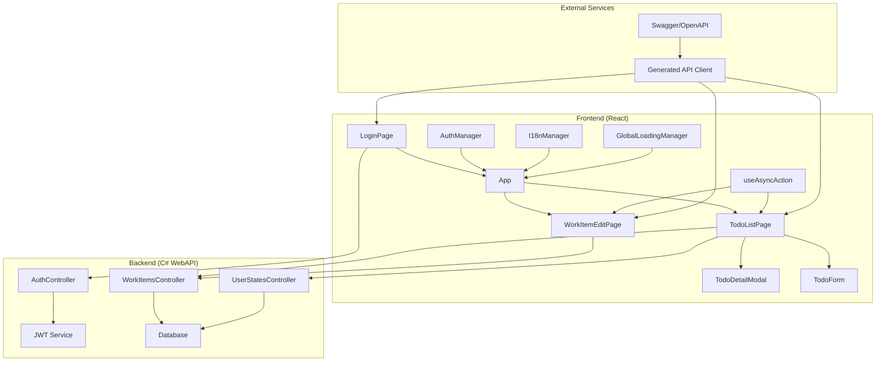
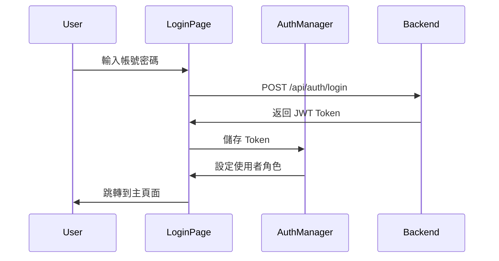
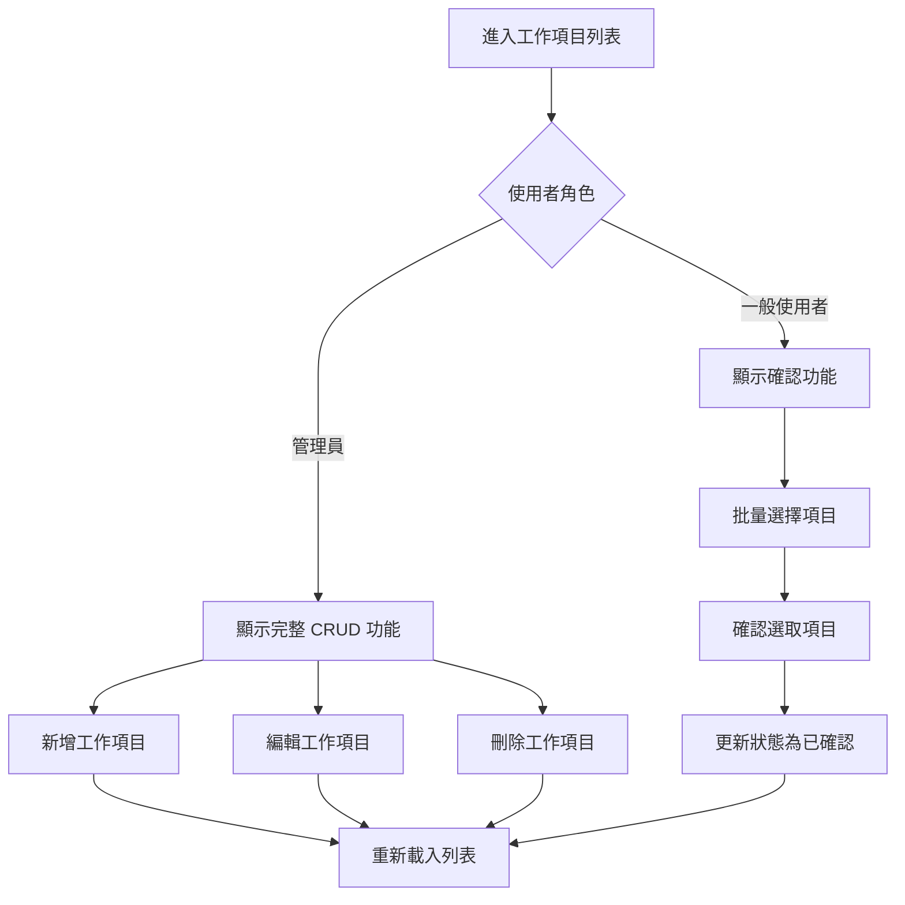

# Work Items Management System

一個基於 React + TypeScript 的工作項目管理系統，支援多國語系、角色權限控制和即時狀態更新。

## 🌟 已實現功能

### 🔐 身份驗證與權限管理
- **JWT Token 認證**：登入/註冊機制
- **角色權限控制**：管理員與一般使用者不同權限
- **自動 Token 刷新**：無縫的使用者體驗
- **登出機制**：安全的登出流程

### 📋 工作項目管理
- **CRUD 操作**：建立、讀取、更新、刪除工作項目
- **狀態管理**：待確認 ↔ 已確認狀態切換
- **批量操作**：多選確認功能
- **即時更新**：狀態變更即時反映
- **詳情查看**：彈窗顯示工作項目詳情

### 🌍 多國語系支援
- **中英文切換**：繁體中文 / English
- **即時切換**：無需重新載入頁面
- **持久化設定**：語言偏好自動儲存
- **完整翻譯**：登入頁面和主應用程式多語系化

### 🎨 現代化 UI/UX
- **響應式設計**：支援桌面、平板、手機
- **Morandi 色彩**：優雅的視覺設計
- **動畫效果**：流暢的互動體驗
- **Loading 動畫**：鉛筆繪製動畫效果
- **Toast 通知**：操作結果即時回饋

## 🏗️ 技術架構

### 前端技術棧
- **React 19** - UI 框架
- **TypeScript** - 型別安全的 JavaScript
- **React Router DOM** - 客戶端路由
- **Axios** - HTTP 請求庫
- **Vite** - 建置工具

### 後端整合
- **C# WebAPI** - RESTful API
- **Swagger/OpenAPI** - API 文件
- **JWT Authentication** - 身份驗證
- **Role-based Access Control** - 角色權限

## 📁 專案結構

```
src/
├── api/
│   └── generated/          # OpenAPI 生成的 API 客戶端
├── components/
│   ├── LoadingOverlay.tsx   # 全域載入遮罩
│   ├── LoadingOverlay.css   # 載入動畫樣式
│   ├── ProtectedRoute.tsx   # 路由保護組件
│   ├── AdminProtectedRoute.tsx # 管理員路由保護
│   ├── TodoForm.tsx         # 工作項目表單
│   ├── TodoDetailModal.tsx  # 工作項目詳情彈窗
│   ├── Toast.tsx           # 通知組件
│   └── InfoDisplay.tsx     # 資訊顯示組件
├── hooks/
│   ├── useI18n.ts          # 多語系 Hook
│   └── useAsyncAction.ts   # 異步操作 Hook
├── pages/
│   ├── App.tsx             # 主應用程式
│   ├── App.css             # 主應用程式樣式
│   ├── LoginPage.tsx       # 登入頁面
│   ├── LoginPage.css       # 登入頁面樣式
│   ├── TodoListPage.tsx    # 工作項目列表
│   ├── TodoListPage.css    # 列表頁面樣式
│   ├── WorkItemEditPage.tsx # 工作項目編輯
│   └── WorkItemEditPage.css # 編輯頁面樣式
├── services/
│   ├── authManager.ts      # 身份驗證管理
│   ├── globalLoadingManager.ts # 全域載入管理
│   └── i18n.ts            # 多語系管理
├── main.tsx               # 應用程式入口
└── style.css              # 全域樣式
```

## 🚀 快速開始

### 環境需求
- Node.js 18+ 
- npm 或 yarn
- C# WebAPI 後端服務 (運行在 https://localhost:7194)

### 安裝步驟

1. **安裝依賴**
```bash
npm install
```

2. **啟動開發伺服器**
```bash
npm run dev
```

3. **開啟瀏覽器**
```
http://localhost:5175
```

### 建置生產版本
```bash
npm run build
```

## 🔧 系統架構圖



## 🎯 功能流程圖

### 登入流程


### 工作項目管理流程


## 🌍 多語系實現

### 語言支援
- **繁體中文 (zh-TW)** - 預設語言
- **English (en-US)** - 英文支援

### 翻譯管理
```typescript
// 使用方式
const { t, currentLanguage, changeLanguage } = useI18n();

// 基本翻譯
t('login') // "登入" 或 "Login"

// 參數化翻譯
t('confirmSuccess', { count: 5 }) // "成功確認 5 個項目。"
```

### 語言切換
- **登入頁面**：右上角國旗按鈕
- **主應用程式**：Header 右側語言切換
- **即時更新**：無需重新載入頁面
- **持久化**：設定儲存在 localStorage

## 🔐 權限控制實現

### 角色定義
- **Admin (管理員)**：完整 CRUD 權限
- **User (使用者)**：確認/撤銷權限

### 路由保護
```typescript
// 一般使用者保護
<ProtectedRoute>
  <App />
</ProtectedRoute>

// 管理員專用路由
<AdminProtectedRoute>
  <WorkItemEditPage />
</AdminProtectedRoute>
```

### API 權限
- **JWT Token**：所有 API 請求都需要有效 Token
- **角色驗證**：後端根據 Token 中的角色資訊控制權限
- **自動刷新**：Token 過期時自動刷新

## 🎨 UI/UX 實現

### 設計系統
- **色彩方案**：Morandi 色系
- **字體**：系統預設字體
- **間距**：8px 基準網格
- **圓角**：統一的邊框圓角

### 響應式設計
- **桌面版** (>768px)：完整功能展示
- **平板版** (768px-480px)：適中調整
- **手機版** (<480px)：緊湊設計

### 動畫效果
- **Loading 動畫**：鉛筆繪製動畫 (1.2秒循環)
- **Hover 效果**：按鈕和卡片互動
- **過渡動畫**：頁面切換和狀態變更
- **光澤效果**：按鈕和卡片的視覺回饋

## 🔧 核心服務實現

### AuthManager
- JWT Token 管理
- 使用者角色解析
- 自動登出機制
- Token 刷新處理

### I18nManager
- 多語系狀態管理
- 翻譯字典管理
- 語言切換功能
- localStorage 持久化

### GlobalLoadingManager
- 全域載入狀態管理
- 最小顯示時間控制 (500ms)
- Loading 訊息管理
- 訂閱者模式更新

### useAsyncAction Hook
- 異步操作狀態管理
- 防止重複提交
- 自動 Loading 整合
- 錯誤處理機制

## 📊 效能優化實現

### 前端優化
- **程式碼分割**：React.lazy 動態載入
- **記憶化**：useMemo 和 useCallback
- **最小載入時間**：500ms 最小顯示時間
- **請求防抖**：防止重複 API 呼叫

### 載入優化
- **Loading 遮罩**：全域載入狀態
- **按鈕禁用**：防止重複點擊
- **錯誤處理**：優雅的錯誤回饋
- **狀態同步**：即時 UI 更新

## 🚀 部署配置

### 建置配置
```bash
# 生產建置
npm run build

# 預覽建置結果
npm run preview
```

### 環境變數
```env
VITE_API_BASE_URL=https://localhost:7194
```

### 部署選項
- **Vercel**：零配置部署
- **Netlify**：靜態網站託管
- **Docker**：容器化部署
- **Nginx**：反向代理配置

## 🤝 開發指南

### 程式碼規範
- **TypeScript**：使用嚴格型別檢查
- **ESLint**：遵循程式碼風格規範
- **組件命名**：PascalCase
- **檔案命名**：kebab-case

### 提交規範
- **feat**：新功能
- **fix**：錯誤修正
- **docs**：文件更新
- **style**：程式碼格式調整
- **refactor**：程式碼重構
- **test**：測試相關
- **chore**：建置過程或輔助工具的變動